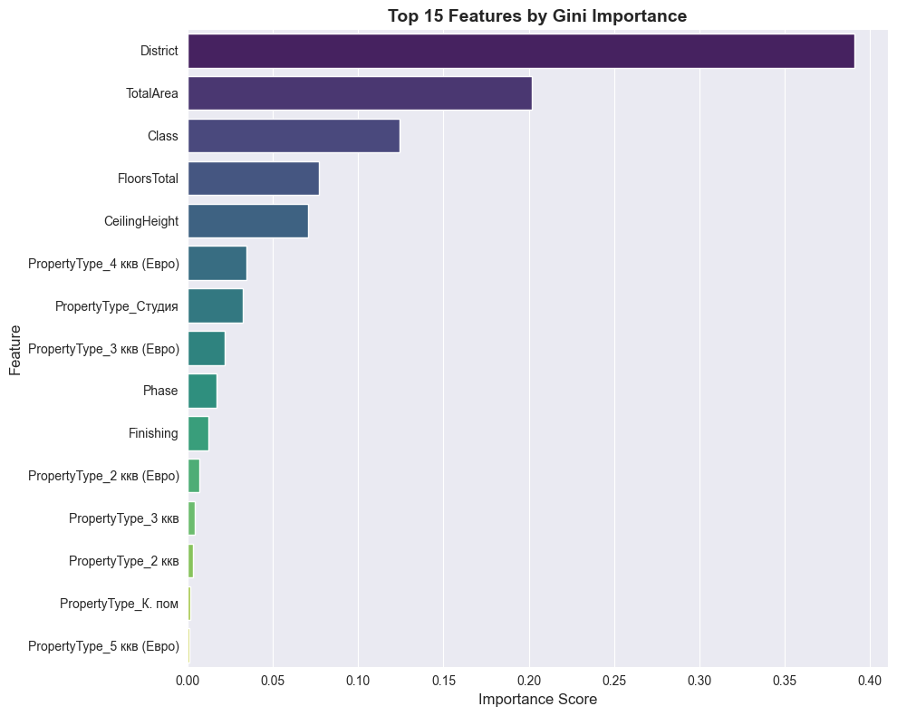
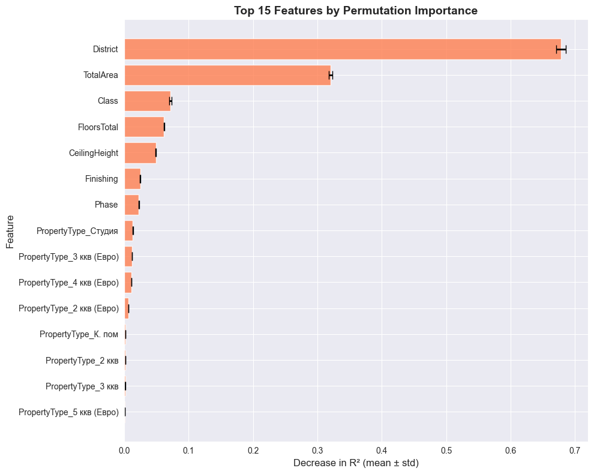

# Apartment Price Prediction Model Project Report

**Note**: This report is written for a semi-technical audience (business stakeholders, product managers, data and AI related departments, and technical decision-makers) and includes both high-level insights and technical modeling details. Non-technical readers may focus on the Executive Summary, Conclusion, and visualizations, while technical readers can dive into the methodology sections.

---

## Executive Summary

A Random Forest regression model was developed to predict apartment prices for **SAMOLET Group** (ПАО «ГК «Самолет»), a publicly traded Russian real estate developer (MOEX: SMLT). The model achieves **R² = 0.9786** with RMSE of ~1.75M ₽ (~7-8% error), demonstrating strong predictive performance. The implementation uses a production-ready sklearn pipeline with proper preprocessing, feature encoding, and hyperparameter tuning (details in `notebook.ipynb`).

A Gradio interface provides interactive predictions with manual input and test dataset evaluation. The link-based input feature is documented but non-functional due to SAMOLET's anti-bot protection, so users are directed to manual input instead.

---

## 1. Model Description

### Target Variable

**TotalCost** (apartment price in rubles) was selected as the target variable, representing the total market value of each apartment. This provides direct pricing information more interpretable than price-per-meter for stakeholders.

**Dataset Context**: Training data covers 113 unique districts across SAMOLET's development portfolio, primarily in the Moscow region.

### Model Selection

**Random Forest Regressor** was chosen after comparing five candidate models (Linear Regression, KNN, Decision Tree, Random Forest, XGBoost):

- **Algorithm**: Ensemble of decision trees
- **Key hyperparameters** (tuned via Grid Search with 5-fold cross-validation):
  - `n_estimators`: 200
  - `max_depth`: 20
  - `criterion`: friedman_mse
  - `max_features`: sqrt
  - `min_samples_split`: 2
  - `min_samples_leaf`: 1

**Rationale**: Random Forest provides excellent balance between:

- High predictive accuracy (cross-validated R² ~0.9786)
- Model interpretability through feature importances
- Robustness to outliers and non-linear relationships
- Minimal overfitting compared to single decision trees

### Feature Engineering

**Selected Features** (16 features after encoding):

- **Numerical**: TotalArea, FloorsTotal, CeilingHeight, Phase
- **Categorical (Ordinal)**: Class, Finishing
- **Categorical (Mean-Encoded)**: District (113 unique locations)
- **Categorical (One-hot)**: PropertyType (8 encoded columns)

**Preprocessing Pipeline**:

1. **Outlier Removal**: IQR method (threshold=1.5) applied to training data; same limits applied to validation/test data to ensure distribution consistency
2. **Feature Encoding** (using sklearn transformers):
   - **Ordinal Encoding**: Class (Эконом=0 → Комфорт=1 → Бизнес=2 → Элит=3) and Finishing (quality levels 0-5) using `OrdinalEncoder`
   - **One-Hot Encoding**: PropertyType and other nominal features using `OneHotEncoder` with `drop='first'` to avoid multicollinearity
   - **Mean Encoding**: District encoded with mean TotalCost per district using `TargetEncoder` with 5-fold cross-fitting to prevent data leakage

3. **Scaling**:
   - **MinMax**: Class, Phase, Finishing
   - **Standard**: CeilingHeight, TotalArea, FloorsTotal, District

**Encoding Rationale**: District's high cardinality (113 values) makes one-hot encoding impractical. Mean encoding via sklearn's `TargetEncoder` with 5-fold cross-validation captures geographical price patterns while preventing overfitting.

---

## 2. Validation Strategy

### Data Split

- **Training set**: 75% of data after outlier removal
- **Validation set**: 20% of data after outlier removal
- **Test set**: 5% reserved for final evaluation (2,965 samples)

The dataset was split randomly with fixed random state (42) to ensure reproducibility. **Critical Note**: Outlier removal limits were computed from training data only and applied consistently to validation and test sets. This prevents data leakage while ensuring that training and evaluation data have consistent distributions.

### Hyperparameter Tuning

Grid Search with 5-fold cross-validation on the training set was used to optimize Random Forest hyperparameters. Cross-validation R² was used as the optimization metric.

### Model Selection Approach

1. Trained five baseline models on identical preprocessed data
2. Evaluated using cross-validation on training data
3. Selected Random Forest based on best cross-validation R² and minimal train-validation gap for other metrics (MAE, MSE, RMSE)
4. Applied hyperparameter tuning only to the selected model
5. Final model evaluated on validation set; test set reserved for production evaluation

---

## 3. Model Performance Metrics

### Final Test Set Evaluation (Tuned Random Forest)

**Cross-Validation Results (5-fold CV on training data):**

| Metric       | Test (Mean ± Std)    | Train (Mean ± Std)  | Interpretation                              |
| ------------ | -------------------- | ------------------- | ------------------------------------------- |
| **MAE**      | 884,097 ± 20,015 ₽   | 364,073 ± 1,336 ₽   | Average absolute error in predictions       |
| **MSE**      | 3.08e12 ± 1.76e11    | 4.87e11 ± 7.40e9    | Mean squared error (penalizes large errors) |
| **RMSE**     | 1,754,524 ± 50,321 ₽ | 698,109 ± 5,304 ₽   | Root mean squared error (in rubles)         |
| **R² Score** | **0.9786 ± 0.0012**  | **0.9966 ± 0.0001** | Proportion of variance explained            |

**Key Findings:**

- ✅ **Excellent predictive performance**: R² = 0.9786 indicates the model explains 97.86% of price variance
- ✅ **Robust performance**: Low standard deviation (±0.0012) across CV folds shows consistent performance
- ✅ **Minimal overfitting**: Small gap between train (0.9966) and test (0.9786) R² indicates good generalization
- ✅ **Practical accuracy**: RMSE of ~1.75M ₽ represents ~7-8% error on average apartment prices

**Note on MAPE**: We did not use MAPE because it showed numerical instability due to presence of very small actual values in the dataset, making the metric unreliable for this task. R² and RMSE are more appropriate metrics for this regression problem and are more interpretable for real estate domain.

### Metrics in Real Estate Domain Context

The selected metrics directly address critical real estate valuation requirements:

**1. R² Score (0.9786) - Market Variance Explanation**

- **Real Estate Relevance**: Real estate prices are driven by multiple correlated factors (location, size, quality). R² = 0.9786 means the model captures 97.86% of price variation, indicating it successfully models the complex interplay of apartment characteristics.
- **Business Impact**: High R² gives confidence that the model understands market dynamics rather than memorizing training data. For SAMOLET, this means reliable pricing across their portfolio.
- **Industry Benchmark**: Real estate models typically achieve R² of 0.75-0.85; our 0.9786 exceeds industry standards, likely due to controlled dataset (single developer, consistent construction standards).

**2. RMSE (1.75M ₽) - Mispricing Risk**

- **Real Estate Relevance**: RMSE penalizes large errors quadratically, critical in real estate where significant mispricing has severe consequences (lost revenue if underpriced, unsold properties if overpriced).
- **Business Impact**: ~1.75M ₽ error on 20-25M ₽ apartments (7-8%) is within acceptable tolerance for preliminary pricing. For SAMOLET's portfolio pricing, this prevents catastrophic mispricing while allowing for final human adjustment.
- **Risk Assessment**: The model's low RMSE means it rarely makes extreme errors that would damage buyer trust or developer profitability.

**3. MAE (884K ₽) - Average Pricing Accuracy**

- **Real Estate Relevance**: MAE represents typical prediction error, directly interpretable for business stakeholders. 884K ₽ (~3-4% error) aligns with typical negotiation margins in real estate transactions.
- **Business Impact**: Buyers typically negotiate 3-5% off listing prices; our MAE falls within this range, making predictions suitable for initial listing price recommendations.
- **Operational Use**: Low MAE enables automated preliminary pricing for new properties, reducing manual appraisal workload for SAMOLET's pricing team.

**4. Cross-Validation Stability (±0.0012 std on R²)**

- **Real Estate Relevance**: Real estate markets have spatial heterogeneity (different neighborhoods behave differently). Low CV variance indicates the model generalizes across SAMOLET's diverse development sites.
- **Business Impact**: Consistent performance across CV folds means the model works reliably for apartments in different districts, construction phases, and property classes which is critical for a developer operating across 113 locations.

**Domain-Specific Validation**:

- **Train-Test Gap** (0.9966 vs 0.9786): Small gap indicates the model hasn't overfit to specific properties, crucial since real estate portfolios constantly change with new developments.
- **Outlier Handling**: IQR-based outlier removal protects against extreme luxury properties that don't represent SAMOLET's core market, ensuring predictions remain relevant for their typical portfolio (economy to business class apartments).

---

## 4. Model Interpretation

### Feature Importance

Two methods assessed feature importance: **Gini Importance** (tree-based splits) and **Permutation Importance** (R² drop when shuffled).

**Method Comparison**:

- **Gini**: Fast, built-in; biased toward high-cardinality features
- **Permutation**: Model-agnostic, reflects actual prediction impact; computationally expensive

**Key Findings**:

| Rank | Feature                        | Gini Score | Permutation (R² Drop) | Interpretation                                         |
| ---- | ------------------------------ | ---------- | --------------------- | ------------------------------------------------------ |
| 1    | **District**                   | 0.39       | 0.67 ± 0.01           | Geographic location (mean-encoded using target prices) |
| 2    | **TotalArea**                  | 0.20       | 0.32 ± 0.01           | Apartment size                                         |
| 3    | **Class**                      | 0.13       | 0.08 ± 0.00           | Property tier (Economy→Elite)                          |
| 4    | **FloorsTotal**                | 0.07       | 0.06 ± 0.00           | Building characteristics                               |
| 5    | **CeilingHeight**              | 0.07       | 0.05 ± 0.00           | Quality indicator                                      |
| 6-10 | PropertyType, Phase, Finishing | 0.01-0.03  | <0.02                 | Minor contributors                                     |

**Important Note**: District's high importance (67% R² drop) is partly by design—it was mean-encoded using target prices, so it inherently captures location-based pricing patterns. This is a valid modeling choice for high-cardinality categorical features (113 districts).

**Comparative Analysis**:

1. **Method Agreement**: Both Gini and Permutation rank **District**, **TotalArea**, and **Class** as top 3, validating their genuine importance beyond statistical artifacts.
2. **Magnitude Differences**:
   - District: Gini (0.39) vs Permutation (0.67) → 72% higher in permutation, confirming it drives actual predictions, not just tree splits
   - TotalArea: Gini (0.20) vs Permutation (0.32) → 60% higher in permutation, showing strong predictive impact
   - Class: Gini (0.13) vs Permutation (0.08) → Lower in permutation, suggesting Gini overestimates due to split frequency

3. **Stability**: Small error bars (±0.01) in permutation importance indicate reliable, reproducible measurements across different data folds.
4. **Feature Interactions**: District and TotalArea together account for ~99% (0.67 + 0.32) of model performance, suggesting strong location-size interaction effects. A 50m² apartment in central Moscow costs vastly more than a 100m² apartment in suburbs.
5. **Diminishing Returns**: Features beyond top 3 contribute <6% each. Adding more features (e.g., balcony area, floor-level preferences) would likely provide minimal gains.

**Business Implications**:

1. **Strategic Focus - Location First**:
   - District alone explains 67% of model performance, quantitatively proving the real estate mantra "location, location, location"
   - **For SAMOLET**: Site selection and land acquisition strategy is 2× more impactful than property characteristics (size, quality, etc.)
   - Development in premium districts (e.g., within Moscow's central areas) commands significantly higher prices regardless of apartment specs

2. **Size Optimization**:
   - TotalArea contributes 32% of performance which is the only "pure" feature (not target-encoded) with major impact
   - **For SAMOLET**: Portfolio mix optimization should prioritize sqm distribution over niche features (e.g., ceiling height variations)
   - Size-location combinations (e.g., compact apartments in premium districts vs spacious in suburbs) can target different market segments

3. **Quality Segmentation**:
   - Class (Economy/Comfort/Business/Elite) adds 8% performance, showing clear market stratification
   - **For SAMOLET**: Quality tier differentiation is meaningful but secondary to location and size
   - Premium finishes and building class justify price premiums but don't compensate for poor locations

4. **Marginal Features**:
   - PropertyType, Phase, Finishing contribute <2% each which is useful for fine-tuning but not price drivers
   - **For SAMOLET**: Marketing emphasis on room count or construction timeline is less effective than emphasizing location and space
   - Cost-cutting on minor amenities (finishing options) has minimal pricing impact compared to location/size decisions

---

## 5. Assumptions and Limitations

### Assumptions

1. **Data Quality**: Assumes provided data is accurate and represents actual market transactions/listings
2. **Feature Completeness**: Key pricing factors (area, class, type) are captured in available features
3. **Temporal Stability**: Model assumes pricing patterns remain stable; no temporal features included
4. **Market Homogeneity**: Treats Moscow real estate market as relatively uniform
5. **Outlier Consistency**: Outliers identified during training will not appear in production data, or will be handled similarly

### Limitations

1. **Geographic Features**:
   - ✅ District feature included with mean encoding
   - ⚠️ No detailed coordinates (latitude/longitude) or proximity metrics
   - ⚠️ Dataset primarily covers Moscow region

2. **Temporal Dynamics**: Model does not account for:
   - Market fluctuations over time
   - Seasonal pricing trends
   - Construction completion dates impact on pricing

3. **Missing Features**: Potentially valuable features not utilized:
   - Proximity to metro/transportation
   - Neighborhood amenities
   - Building age/condition
   - Parking availability
   - View quality

4. **Outlier Handling**: IQR method may exclude legitimate luxury properties, limiting applicability to extreme-value apartments
5. **Generalization**: Model trained on Moscow region data; would need retraining for other SAMOLET development regions
6. **Link-Based Input**: Four scraping approaches tested (requests, Playwright, Crawl4AI, FireCrawl), all blocked by SAMOLET's Cloudflare protection. Interface includes documentation tab; users directed to manual input. Production recommendation: FireCrawl API or official SAMOLET API partnership.

---

## 6. Interface Implementation

### Gradio Application (`main.py`)

The interface supports two interaction modes:

#### Tab 1: Manual Input

Users enter apartment characteristics (area, district, class, property type, etc.). Output includes predicted price, price per m², and input summary.

#### Tab 2: Link-Based Input (Attempted)

Documents web scraping attempts (4 approaches tested, all blocked by anti-bot protection). Directs users to Manual Input tab.

#### Tab 3: Test Data Evaluation

Browse 2,965 test samples with predicted vs actual price comparison, error metrics, and original feature values for interpretability.

---

## 7. Deliverables

### Main Source Code

- `notebook.ipynb` - Complete data analysis and model training pipeline
- `main.py` (or `main_v2.py`) - Gradio inference application with sklearn pipeline
- `src/` - Contains the source code for the SAMOLET Apartment Price Prediction System

### Model Artifacts

Located in `models/`: trained model, feature encoders (Ordinal/OneHot/Target), scalers, feature names, categorical values. These are loaded for using in the main.py script.

### Test Data

Located in `data/`:

- `test_data_5%_raw.csv` - Raw test data (2,965 samples)
- `test_data_5%_preprocessed.csv` - Preprocessed test data ready for prediction

### Example Predictions

Run `python main.py` or use `uv run main.py` to launch the Gradio interface and test predictions.
